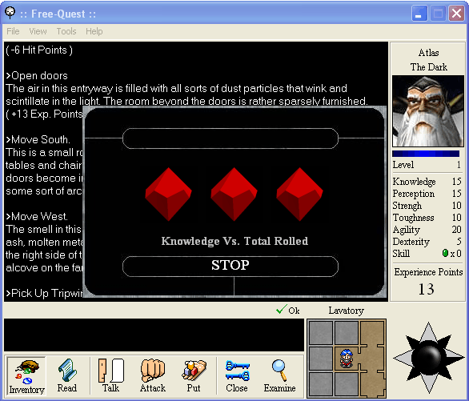



## Free\-Quest v1\.0\.4 \(R\)

### Description

Free-Quest is back. The new options are intented to make the game more customizable.

Some of the new features includes:

-A text entry which lets you explore the game in a wide range. (Free-Maker)

-An Add task button to add any possible action to your adventures. (Quest-Maker)

-Some new options to the elements of the game; Objects, Characters and Others (Quest-Maker)

-"The Burning Sage's Demense" quest, and anything else I didn't mentioned... Enjoy it!

For more information take a look at the web site: www.geocities.com/freequestrpg/
 
### More Info
 

             |
---                |---
**Submitted On**   |2003-12-23 13:34:00
**By**             |[Abel Ricaurte](https://github.com/Planet-Source-Code/PSCIndex/blob/master/ByAuthor/abel-ricaurte.md)
**Level**          |Intermediate
**User Rating**    |5.0 (20 globes from 4 users)
**Compatibility**  |VB 6\.0
**Category**       |[Games](https://github.com/Planet-Source-Code/PSCIndex/blob/master/ByCategory/games__1-38.md)
**World**          |[Visual Basic](https://github.com/Planet-Source-Code/PSCIndex/blob/master/ByWorld/visual-basic.md)
**Archive File**   |[Free\-Quest16865412242003\.zip](https://github.com/Planet-Source-Code/abel-ricaurte-free-quest-v1-0-4-r__1-46856/archive/master.zip)

